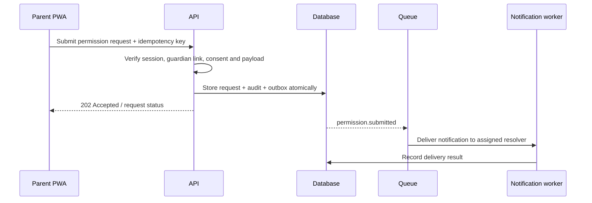

# Critical Data Flows — Pilot Dongko

| Field | Value |
|---|---|
| Status | Draft |
| Scope | Attendance, parent communication, AI draft generation |

## Trust boundaries

1. Browser/device to the application: authenticated HTTPS; client input is untrusted.
2. Application to database/storage: private network and service identity; transaction and access policy are enforced here.
3. Application to notification/AI provider: external processor boundary; send only permitted, minimised data and record the processing purpose.
4. Operator/audit access: privileged boundary; time-bound, least-privilege, and logged.

## Data handling table

| Flow | Minimum data | Classification | Control |
|---|---|---|---|
| Attendance recording | student ID, class/session, status, time, recorder | Restricted child data | assignment check, idempotency, immutable correction history |
| Parent notification | guardian contact, child display name only if approved, event summary | Restricted contact/child data | preference/consent check, provider minimisation, delivery log |
| AI draft | task-specific de-identified/minimised context | Restricted; exclude counselling by default | allow-list task, provider review, human approval, short retention |
| Import | approved source fields and source row reference | Restricted | encrypted staging, validation, dual approval, purge staging |
| Audit | actor/action/target/correlation/time | Sensitive security data | append-only access path, restricted readers, retention policy |

## Sequence: parent permission request

## Deletion and retention implementation note

Retention periods, legal basis, and deletion approval belong in `docs/06-data/retention-and-deletion-schedule.md`. The architecture must support policy-driven expiry jobs, legal holds, verified deletion of attachments, and a non-identifying audit evidence record that a deletion occurred. Backups expire according to their own documented schedule; they are not silently treated as immediate deletion.

