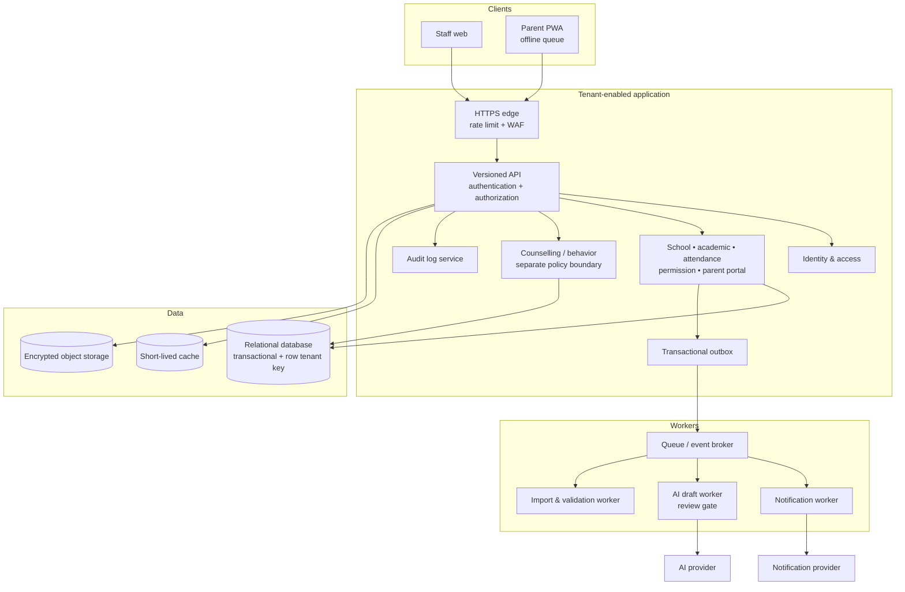

# Solution Architecture — Pilot Dongko

| Field | Value |
|---|---|
| Status | Draft — architecture baseline |
| Decision | Modular monolith with asynchronous workers |
| Deployment unit | One tenant-enabled application and one database cluster |
| Revisit trigger | More than 5 schools, sustained queue backlog, or independently scaling workloads |

## Assumptions to validate at Gate 2

1. The pilot begins with one school, roughly 1,500 students, 100 staff, and a peak of 500 active sessions around attendance time.
2. Staff have browser-capable devices; parent access is primarily Android mobile with intermittent connectivity.
3. Existing records can be imported through CSV at first. No source-system integration is assumed.
4. The school will nominate data owners, reviewers for AI output, and an incident contact before production.
5. This document deliberately does not choose a cloud vendor, framework, AI provider, or attendance hardware.

## Architecture decision

Build a **modular monolith**, exposing one versioned HTTP API, backed by a relational database and object storage. Keep domain modules isolated in code and publish durable domain events through an outbox table. Background workers deliver notifications, generate reviewed AI drafts, process imports, and perform retention work.

This keeps the pilot simple to deploy and audit while avoiding the two risks of a single undifferentiated application: unclear access boundaries and unsafe synchronous integrations. Modules may be extracted only when a measured scaling or ownership need appears.



## Domain boundaries

| Module | Owns | Must not own |
|---|---|---|
| Identity & access | accounts, sessions, roles, parent-child links | academic or counselling decisions |
| School management | tenant, school profile, staff, students, classes, enrolment | authentication credentials |
| Academic | timetable, tasks, assessments, grades, progress | guardian consent |
| Attendance & permission | check-in/out, absence, late status, permission requests | behavioural/counselling notes |
| Parent portal | read models and guardian submissions | unrestricted internal records |
| Counselling & behaviour | case records with narrowly scoped policy | AI automated decisions or parent disclosure by default |
| Notification | templates, delivery state, preference checks | source-of-truth student data |
| AI assistance | prompt provenance, draft, review/approval state | direct changes to student records |
| Audit & compliance | append-only action evidence and retention jobs | business mutation authority |

Every business table has `tenant_id` (school ID). Authorization checks tenant membership and domain relationship (for example, assignment to a class or guardianship link) before data access. Database row-level protection is recommended as a second enforcement layer; application authorization remains the primary rule engine.

## Core data model

```mermaid
erDiagram
  SCHOOL ||--o{ USER_MEMBERSHIP : has
  SCHOOL ||--o{ STUDENT : enrols
  STUDENT ||--o{ GUARDIAN_LINK : linked_to
  USER ||--o{ GUARDIAN_LINK : owns
  SCHOOL ||--o{ CLASS : has
  STUDENT }o--o{ CLASS_ENROLMENT : attends
  CLASS ||--o{ ATTENDANCE_RECORD : records
  STUDENT ||--o{ ATTENDANCE_RECORD : has
  CLASS ||--o{ ASSIGNMENT : publishes
  ASSIGNMENT ||--o{ SUBMISSION : receives
  STUDENT ||--o{ GRADE : receives
  USER ||--o{ AI_DRAFT : requests
  AI_DRAFT ||--o| AI_REVIEW : requires
  USER ||--o{ AUDIT_EVENT : performs
```

Key invariants: a guardian link needs verification and expiry/revocation handling; an attendance record is unique per student/session/date; corrections retain old and new values; published grade changes are auditable; an AI draft cannot be sent or applied until an authorized reviewer approves it.

## Critical flows

### Attendance with poor connectivity

1. The teacher selects the assigned class and records attendance. The PWA validates identity, class assignment, and an idempotency key locally.
2. If offline, it encrypts the smallest needed pending payload in device storage and displays it as **pending**, never as final.
3. On reconnect, the client submits `Idempotency-Key`; the API commits the attendance record and audit event in one transaction.
4. The outbox publishes `attendance.recorded`. Notification delivery happens outside the request path and records provider status.
5. Conflicting late submissions are surfaced to the homeroom teacher; the client never silently overwrites a corrected record.

### AI Teacher Copilot / Parent Digest

1. An authorized user selects an allowed task and relevant records. Sensitive counselling content and unnecessary identifiers are excluded by policy.
2. The server creates a versioned request record, applies minimisation/redaction, and sends only permitted context to an approved provider.
3. The worker stores output as an `AI_DRAFT` with source references, model/provider/version, and retention expiry.
4. A designated human reviews, edits if necessary, and explicitly approves or rejects. Only the approved version may be shared.
5. The system audits request, reviewer, publication, and recipient; users can report unsafe output.

## API contract conventions

- JSON REST under `/api/v1`; OpenAPI is the source contract. Breaking changes require `/v2` or a documented compatibility period.
- OIDC-compatible session/token layer; browser clients use secure, short-lived sessions and CSRF protection.
- All list endpoints require pagination, stable sorting, tenant-scoped filtering, and field minimisation.
- Mutating requests require `Idempotency-Key`; responses include a request/correlation ID.
- Errors use `application/problem+json`, never disclose another tenant or hidden-resource existence.

| Endpoint | Purpose | Required relationship |
|---|---|---|
| `POST /api/v1/attendance-records` | Record class attendance | Assigned teacher/admin |
| `PATCH /api/v1/attendance-records/{id}` | Correct status with reason | Authorized resolver |
| `POST /api/v1/permission-requests` | Guardian submits absence/permission | Verified guardian link |
| `POST /api/v1/grades` | Create/publish a grade | Assigned teacher |
| `GET /api/v1/parent/children/{id}/summary` | Parent-safe child summary | Verified guardian link |
| `POST /api/v1/ai-drafts` | Request a constrained draft | Authorized staff + allowed task |
| `POST /api/v1/ai-drafts/{id}/review` | Approve/reject draft | Designated reviewer |

## Storage, cache, and events

Use a relational database for all system-of-record data and transactions. Object storage holds submitted attachments only after malware scanning; the database holds metadata, ownership, classification, and access policy. Encrypt data in transit and at rest; back up database and storage independently.

Cache only derived, low-risk data such as navigation permissions and timetable read models with short TTLs. Do not cache counselling content, raw AI prompts, or authorization decisions beyond their safe session bounds. Invalidate by event after a role, guardian link, or timetable change.

| Event | Producer | Consumer | Delivery rule |
|---|---|---|---|
| `attendance.recorded` | Attendance | Notification, reporting | At-least-once; consumer idempotent |
| `permission.submitted` | Permission | Homeroom workflow, notification | At-least-once |
| `grade.published` | Academic | Parent digest/notification | At-least-once, after publication |
| `ai.draft.created` | AI assistance | Review queue | Never auto-publish |
| `user.access.changed` | Identity | Cache invalidator, audit | Immediate revocation path |

The outbox row is created in the same database transaction as its business change. Workers retry transient failures with exponential backoff and jitter; after a bounded number of attempts, send to a dead-letter queue and alert an operator. Provider calls use timeouts and circuit breakers.

## Security, privacy, and audit controls

- Default-deny RBAC plus relationship checks; separate privileged support access, time-bound and audited.
- Classify counselling, behaviour, location, and child identity data as restricted; hide it from standard parent and teacher read models unless policy explicitly grants access.
- Log actor, tenant, action, target type/ID, before/after hashes or approved change details, time, correlation ID, and result. Restrict audit-log access and protect it from ordinary update/delete paths.
- Store consent/notice version, scope, actor, timestamp, and withdrawal. Consent withdrawal blocks future optional processing without erasing legally required records prematurely.
- Never put student PII in application logs, analytics, error trackers, queue message names, or AI prompts unless explicitly allowed and documented.
- Use secrets manager references, key rotation, vulnerability patching, malware scanning, rate limits, and security headers.

## Availability and recovery objectives (proposed)

| Capability | Target | Degraded behaviour |
|---|---|---|
| Core read/write | 99.5% monthly during school operating hours | Show clear incident state; no unsafe local finalisation |
| Attendance submission | p95 API under 2 seconds online | Offline queue with visible pending state |
| Notification | Asynchronous; 95% accepted within 10 minutes | Retain/retry; school can use fallback SOP |
| Recovery point (RPO) | ≤ 24 hours initially; validate against school tolerance | Restore from encrypted backup |
| Recovery time (RTO) | ≤ 8 hours initially; validate through DR test | Manual attendance/SOP fallback |

Monitor request latency/error rate, login failures, authorization denials, queue age/dead letters, import rejection rate, backup completion/restore tests, notification delivery, AI review rate, and audit-log pipeline health. Alert on an owner-routed severity policy; alerts must contain no student PII.

## Deployment baseline

Maintain development, staging, and production environments with separate identities, secrets, databases, storage buckets, and notification/AI credentials. CI deploys immutable artifacts after tests, security scans, migration validation, and approval. Database migrations are backward-compatible first, then code deploy, then delayed cleanup. Production access is least-privilege and audited. Restore tests and a rollback drill are required before Gate 5.

## Trade-offs and review triggers

| Choice | Why now | Cost / when to revisit |
|---|---|---|
| Modular monolith | Faster pilot delivery, one transaction boundary, simpler audit | Extract notification/AI or read workloads when deployments or scale demand independent release |
| Relational database | Strong integrity for enrolment, attendance, grades, and audit relationships | Add analytics store only after aggregate reporting affects transactional performance |
| Transactional outbox | Prevents lost notification/event after database commit | Requires worker operations and idempotent consumers |
| PWA offline queue | Supports inconsistent school connectivity without an initial native app | Device storage/security and conflict UX need UAT validation |
| Human-reviewed AI drafts | Protects children from automatic judgement | Adds review workload; measure turnaround and quality before broader automation |
| Tenant key from day one | Makes later multi-school separation possible | Higher test burden; do not enable cross-tenant reports without a new privacy review |

Revisit this design when actual concurrency, connectivity, data-retention rules, school integrations, cloud/data-residency requirements, AI provider terms, or the number of schools are known.

