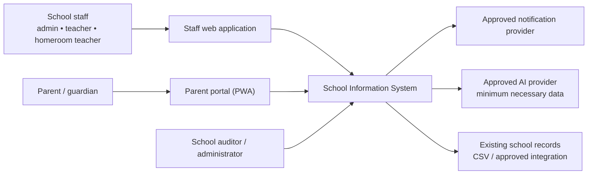

# System Context — Pilot Dongko

| Field | Value |
|---|---|
| Status | Draft — requires school, privacy, and technical review |
| Owner | System architect |
| Scope | Pilot for one school; designed to become multi-school |
| Related | PRD, SRS, roles-and-permissions, DPIA |

## Purpose and boundary

The system is the operational record for academic activity, attendance and permissions, parent communication, and reviewed AI assistance. It is **not** an automated decision-maker for students. A teacher, homeroom teacher, counsellor, or designated school officer remains accountable for every student-impacting action.

External systems never receive the system database directly. Imports are staged, validated, and approved; notification and AI providers receive scoped requests only.

## Primary actors

| Actor | Main permitted outcome |
|---|---|
| School administrator | Manages school setup, classes, accounts, and approved corrections |
| Teacher | Manages assigned classes, attendance, tasks, and grades |
| Homeroom teacher | Sees assigned students and resolves attendance exceptions |
| Parent/guardian | Sees only linked child information and confirms permissions where required |
| Counsellor | Restricted counselling record access; no parent access by default |
| School leader/auditor | Aggregated reports and immutable audit trail, subject to role policy |

## Explicit non-goals for the pilot

- Continuous student location tracking, GPS hardware, and automated emergency dispatch.
- Automatic student risk scores, ranking, or action based on AI output.
- Cross-school data aggregation or public data publication.
- Direct write access for AI models, notification vendors, or import files.

